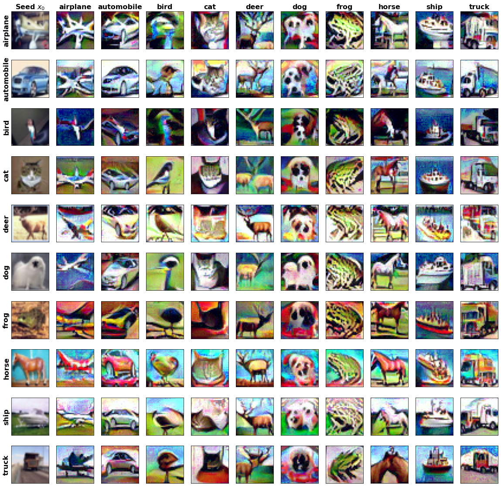

# Repository for ON THE HUMAN-RECOGNIZABILITY PHENOMENON OF ADVERSARIALLYTRAINED DEEP IMAGE CLASSIFIERS

Code to reproduce the results from (TODO: LINK TO PAPER).

# To use this code
- Install the requirements via `pip install -r requirements.txt`. 
- Create the following environment variables:
    - `DATA_DIR=/path/to/data/` in which CIFAR-10 either exists already or will be downloaded into.
    - `OUT_DIR=/path/to/output/` in which log files and trained models will be saved when running the `train_*.py` scripts.
- (Optional) Download the [pretrained models](https://drive.google.com/file/d/1YQVMXEivaF1niFCOkpAAtrWksM5dERQ0/view?usp=sharing) and unzip them into the directory pointed to by `OUT_DIR`.
- After training/downloading models, you can produce similar visualizations to those found in the paper using the [inversion_attack.ipynb](src/notebooks/inversion_attack.ipynb) notebook.

## Training notes
- If the CIFAR-10 dataset does not already exist in `DATA_DIR`, you will need to pass the `--download-data` flag to the first `train_*.py` script that you run.
- Using the `--no-eval` flag may be desirable if you want to train models quickly -- the robust accuracy evaluation run by default at the end is time-consuming.
- The [train_fim_penalty.py](src/train_fim_penalty.py) script can run into numerical stability problems occasionally and may require multiple runs to get a non-degenerate model.
- The [train_defensive_distillation.py](src/train_defensive_distillation.py) script will by default subprocess the [train_standard.py](src/train_standard.py) script with a high temperature value before training the student model.

# Organization
- Model training scripts are provided under the naming convention [src/train_*.py](src/train_standard.py).
- CIFAR-10 specific values are contained in [constants.py](src/constants.py).
- PyTorch boilerplate is contained in [experiment.py](src/experiment.py).
- `src/notebooks`
    - [inversion_attack.ipynb](src/notebooks/inversion_attack.ipynb) provides a jupyter notebook to produce similar visualizations as those found in the paper.
- `src/attack/`
    - An implementation of the Madry PGD attack is available in [pgd.py](src/attack/pgd).
    - An implementation of a model inversion attack via minimizing the cross-entropy loss with respect to a target label is available in [inversion.py](src/attack/inversion.py).
- `src/models/`
    - Implementation of [standard](src/models/resnet.py) and [pre-activation](src/models/preact_resnet.py) ResNets.

# License

ON THE HUMAN-RECOGNIZABILITY PHENOMENON OF ADVERSARIALLY TRAINED DEEP IMAGE CLASSIFIERS

Copyright 2020 Carnegie Mellon University.

NO WARRANTY. THIS CARNEGIE MELLON UNIVERSITY AND SOFTWARE ENGINEERING INSTITUTE 
MATERIAL IS FURNISHED ON AN "AS-IS" BASIS. CARNEGIE MELLON UNIVERSITY MAKES NO 
WARRANTIES OF ANY KIND, EITHER EXPRESSED OR IMPLIED, AS TO ANY MATTER INCLUDING, 
BUT NOT LIMITED TO, WARRANTY OF FITNESS FOR PURPOSE OR MERCHANTABILITY, 
EXCLUSIVITY, OR RESULTS OBTAINED FROM USE OF THE MATERIAL. CARNEGIE MELLON 
UNIVERSITY DOES NOT MAKE ANY WARRANTY OF ANY KIND WITH RESPECT TO FREEDOM FROM 
PATENT, TRADEMARK, OR COPYRIGHT INFRINGEMENT.

Released under a MIT (SEI)-style license, please see license.txt or contact permission@sei.cmu.edu for full terms.

[DISTRIBUTION STATEMENT A] This material has been approved for public release and unlimited distribution.  
Please see Copyright notice for non-US Government use and distribution.

Carnegie Mellon® is registered in the U.S. Patent and Trademark Office by Carnegie Mellon University.
This Software includes and/or makes use of the following Third-Party Software subject to its own license:

1. Python (https://docs.python.org/3/license.html#psf-license-agreement-for-python-release) Copyright 2001-2020 
Python Software Foundation 2001-2020.

2. PyTorch (https://github.com/pytorch/pytorch/blob/master/LICENSE#L3-L11) Copyright 2016 Facebook Inc.

3. Torchvision (https://github.com/pytorch/vision/blob/master/LICENSE) Copyright 2016 Soumith Chintala.

4. NumPy (https://github.com/numpy/numpy/blob/master/LICENSE.txt) Copyright 2005-2020 NumPy Developers.

5. tqdm (https://github.com/tqdm/tqdm/blob/master/LICENCE) Copyright noamraph 2013.

6. Jupyter (https://github.com/jupyter/notebook/blob/master/LICENSE) Copyright IPython Development Team 
2001-2015, Jupyter Development Team 2015-2020 IPython Development Team 2001-2015, Jupyter Development 
Team 2015-2020.

DM20-1153
